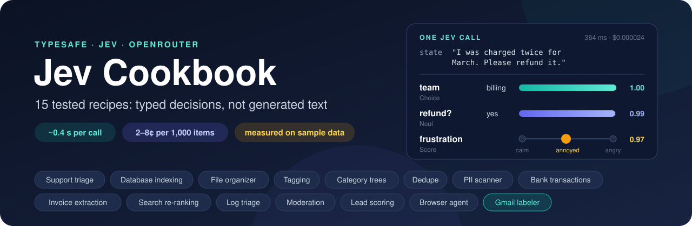
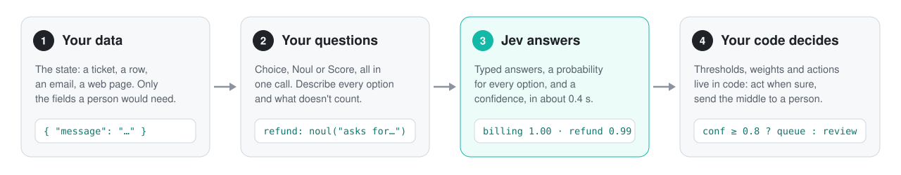

# Jev Cookbook

<p align="center"></p>

**Practical, tested recipes for [TypeSafe's Jev](https://docs.typesafe.ai/introduction), the fast decision model on [OpenRouter](https://openrouter.ai/typesafe/jev-1.13).** Fifteen real-world jobs, each with a runnable script, a small labelled dataset and measured results: support triage, database indexing, a file organizer, tagging, category trees, duplicate detection, PII scanning, bank transactions, invoice extraction, search, log triage, moderation, lead scoring, a browser agent and a Gmail labeler that connects to your own inbox.

Created by **[Jeroen Erne](https://www.linkedin.com/in/jeroenerne/)** ([nexibeo.com](https://nexibeo.com) · [completeaitraining.com](https://completeaitraining.com)), built together with Claude.

## What Jev is, in 30 seconds

Jev is not a chat model. You send it some data (the `state`) and a set of questions with fixed answers, and it returns typed answers with probabilities, usually in under half a second.

- **Choice:** pick one option from a list you define (up to 255), with a probability for each.
- **Noul:** the probability that a yes/no statement is true.
- **Score:** a position on levels you describe, lowest first.

It never writes text, so it can't hallucinate an answer outside your options, and it is cheap: $0.042 per million input tokens, output free. Across these recipes that's **2 to 8 cents per 1,000 items**. It can still pick the wrong option, which is why every recipe routes on confidence and measures its errors.

```js
// One call, three questions, typed answers.
const res = await fetch('https://openrouter.ai/api/alpha/decisions', {
  method: 'POST',
  headers: { Authorization: `Bearer ${process.env.OPENROUTER_API_KEY}`, 'Content-Type': 'application/json' },
  body: JSON.stringify({
    model: '~typesafe/jev-latest',
    state: { message: 'I was charged twice for March. Please refund the duplicate.' },
    questions: {
      team: { type: 'choice', instructions: 'Which team should handle `message`?',
              criteria: { billing: 'Payments, invoices, refunds', technical: 'Bugs and outages', sales: 'Pricing and plans' } },
      refund: { type: 'noul', instructions: 'The customer in `message` asks for money back' },
    },
  }),
});
const { answers } = await res.json();
// answers.team   -> { choice: 'billing', probabilities: { billing: 1, ... }, confidence: 1 }
// answers.refund -> { noul: 0.99 }
```

Two things trip people up. Jev lives at `/api/alpha/decisions`, not the chat endpoint, which rejects it. And the model id `~typesafe/jev-latest` needs the tilde. It always points to the newest Jev.

## Quick start

Needs Node 22.9 or newer and an [OpenRouter key](https://openrouter.ai/settings/keys).

```bash
git clone https://github.com/nexibeo/jev-cookbook.git
cd jev-cookbook
cp .env.example .env        # paste your OpenRouter key into .env
npm run quickstart          # one call, all three question types
npm run 01                  # any recipe by number
npm run all                 # every recipe except the browser agent (about 2 cents)
npm run gmail               # label your own Gmail (dry run first; setup in recipes/15-gmail-labeler)
```

Recipes 01 to 13 and 15 have no dependencies. Recipe 14 (the browser agent) needs `npm install` and a Chromium: `npx playwright install chromium`, or set `CHROME_PATH`. Recipe 15 needs your own free Google OAuth client to reach your Gmail; its sample inbox works without one.

## The recipes

Results are from live runs on September 19, 2026 against `~typesafe/jev-latest` (answering as `typesafe/jev-1.13-20260917`). Every run saves its full output in [`results/`](results/).

| # | Recipe | The real-world job | Jev questions per item | Result on the sample data |
| --- | --- | --- | --- | --- |
| 01 | [Support triage](recipes/01-support-triage) | Route tickets, flag urgency, frustration and refund requests | Choice + 2 Nouls + Score | Right team 34/34; genuinely ambiguous tickets dropped to 0.60–0.67 confidence and went to a person. Urgency 94%, refund requests 100% |
| 02 | [Database indexing](recipes/02-database-indexing) | Turn free-text rows into typed, indexed SQLite columns you can query | 2 Choices + 8 Nouls | Category 35/36; 41 tags stored; re-runs only index new rows |
| 03 | [File organizer](recipes/03-file-organizer) | Sort a messy folder into category folders with dated file names | Choice + Noul + date Choice | Category 24/24, document date 23/24 |
| 04 | [Multi-label tagging](recipes/04-multi-label-tagging) | Tag articles from a fixed vocabulary | 13 Nouls | F1 87% at threshold 0.5; precision 97% at 0.9 |
| 05 | [Category trees](recipes/05-taxonomy-tree) | Place products in an 8 × 6 taxonomy, flat or level by level | 1 Choice, or 2 | 36/36 both ways; level by level used 11% fewer tokens |
| 06 | [Duplicate detection](recipes/06-dedupe-records) | Decide whether two company records are the same | Score | 0 wrong automatic merges; 2 hard pairs sent to review. Without code-checked facts: 1 wrong |
| 07 | [PII column scanner](recipes/07-pii-column-scanner) | Label database columns for a data catalog: type, personal data, sensitivity | Choice + Noul + Score | Type 25/25, sensitivity 25/25, personal data 23/25; all 5 restricted columns caught |
| 08 | [Bank transactions](recipes/08-transaction-categorizer) | Budget categories from cryptic bank descriptors | Choice + Noul | 35/36; recurring bills found |
| 09 | [Invoice extraction](recipes/09-extract-by-picking) | Invoice number, dates and total, in several languages | Noul + 4 Choices over regex candidates | 40/40 fields; a quote correctly returned no invoice fields |
| 10 | [Search re-ranking](recipes/10-search-rerank) | Find the help article that answers a question | Choice | Keyword search 2/16 → with Jev 12/16 → Jev over all 30 articles 16/16; unanswerable questions recognised 2/2 |
| 11 | [Log triage](recipes/11-log-triage) | Decide what pages on-call, what becomes a ticket, what's noise | Choice + Score + 5 Nouls | Component 96%. Paging on one severity score caught 4/7 critical events; splitting it into 4 yes/no questions caught 7/7 |
| 12 | [Moderation and guardrails](recipes/12-moderation-guardrails) | Screen posts for spam, harassment, prompt injection, doxxing, self-harm | 5 Nouls | 0 harmful posts published, 0 clean posts blocked; every hazard caught |
| 13 | [Lead scoring](recipes/13-lead-scoring) | Rank inbound sales leads, explainably | 4 Scores + Noul | The top 5 by score are exactly the 5 priority-A leads |
| 14 | [Browser agent](recipes/14-browser-agent) | Navigate real websites, search and fill forms | Choice + 2 Nouls per step | 5/6 live tasks passed, $0.0005–0.003 each; the failure is a documented near-miss |
| 15 | [Gmail labeler](recipes/15-gmail-labeler) | Connect your Gmail and label every email by type, "needs reply" and "deadline" | Choice + 2 Nouls, plus code-checked header facts | Sample inbox: category 30/30, needs reply and deadline 93%, phishing 3/3 with no false alarms. Only ever adds labels |

**More every week:** three new recipes land every Monday until mid-October 2026. See the [roadmap](ROADMAP.md).

Also here: [`examples/quickstart.mjs`](examples/quickstart.mjs), a shared client in [`lib/jev.mjs`](lib/jev.mjs), regex candidate finders in [`lib/candidates.mjs`](lib/candidates.mjs), the full [guide](docs/GUIDE.md), and a [case study](docs/case-study-templatesgrokbot.md) that files 3,267 real templates.

## How every recipe works

The pattern is the same everywhere: **your code prepares the data and owns every decision; Jev answers narrow questions.**

<p align="center"></p>

1. **Build the state:** the few fields a person would need to judge the item, as JSON. Trim everything else.
2. **Ask everything in one call:** a Choice for one-answer decisions, one Noul per label for multi-label ones, a Score for anything ordered. Questions run in parallel, so ten more cost almost nothing.
3. **Decide in code:** thresholds, weights and actions live in your code, so you can tune them without touching the questions.
4. **Route on confidence:** act when Jev is sure, send the middle band to a person, and log which model version answered.

```js
import { ask, choice, noul, route } from './lib/jev.mjs';

const a = await ask({ message: ticket.text }, {
  team: choice('Which team should handle `message`?', { billing: '...', technical: '...', account: '...' }),
  urgent: noul('The customer in `message` needs a response within hours'),
});
if (route(a.team.confidence) === 'auto') queue(a.team.choice); else askAPerson(ticket);
```

## What we learned

- **Describe every option, and say what doesn't count.** Jev reads literally. On a real catalog of AI bots, a plain topic question tagged 36 of 100 templates "Generative AI" just for being AI; one sentence saying that doesn't count brought it to 6 ([case study](docs/case-study-templatesgrokbot.md)).
- **Numbers, dates and exact matching are code's job.** Let code parse amounts, compare phone numbers or read the sign of a transaction, then hand Jev the result as a fact ([06](recipes/06-dedupe-records), [08](recipes/08-transaction-categorizer)).
- **Pick, don't extract.** Jev can't copy text out of a document, but it's excellent at choosing among regex-found candidates, and a `none` option stops it inventing values ([03](recipes/03-file-organizer), [09](recipes/09-extract-by-picking)).
- **Split "how bad" into specific yes/no questions.** A single severity Score bunches in the middle; four concrete Nouls paged every critical event ([11](recipes/11-log-triage)). The same idea ranks sales leads explainably ([13](recipes/13-lead-scoring)).
- **Confidence tells you where the doubt is.** Clear tickets scored 1.00; tickets that fit two teams scored 0.60–0.67 ([01](recipes/01-support-triage)). Route the middle band to people.
- **Leave a review band around every cut-off.** Scores near a threshold can shift a little between runs (a duplicate pair scored 0.49 once and 0.52 the next time).
- **Small collections don't need retrieval.** Up to 255 items fit in one Choice, and reading all of them beat keyword search plus re-ranking ([10](recipes/10-search-rerank)).
- **Thresholds are a dial.** The same answers give precision 80% / recall 94% at 0.3, or precision 97% / recall 64% at 0.9 ([04](recipes/04-multi-label-tagging)).
- **Different mistakes cost different amounts.** Moderation blocks only when sure, holds the middle for a moderator, and escalates self-harm early ([12](recipes/12-moderation-guardrails)).
- **A confident answer can still be a near-miss.** The browser agent opened "Cold Outreach" when asked for "Cold Email", and both of its checks agreed. Verify outcomes in code ([14](recipes/14-browser-agent)).

## Cost and speed

| | |
| --- | --- |
| Price | $0.042 per million input tokens, output free |
| Typical call | 500 to 2,000 input tokens: $0.00002 to $0.00008 |
| Median latency per call | 0.34 to 0.45 s in these runs |
| All of recipes 01–13 | 425 calls, $0.015 |
| Browser tasks | $0.0005 to $0.003 per task, including the typing model |

## A note on the numbers

The datasets are small and hand-made (16 to 36 items each), written to look like real data with some deliberately ambiguous cases. The scores show how each technique behaves; they are not benchmarks. Before relying on a recipe, label a few hundred of your own items and measure. Each script prints its errors, so that takes minutes.

## Project layout

```
lib/jev.mjs            the client: ask(), question builders, pickLabels(), route(), mapLimit(), metrics
lib/candidates.mjs     regex finders for dates, amounts and reference numbers
examples/quickstart.mjs
recipes/NN-name/       one folder per recipe: README, script, sample data
results/               the saved output of every run
docs/GUIDE.md          the full guide: connecting, question design, confidence, weak spots, patterns, browser agents
docs/case-study-templatesgrokbot.md
```

## More reading

- [docs/GUIDE.md](docs/GUIDE.md): everything we learned about instructing Jev, in one place
- [TypeSafe docs](https://docs.typesafe.ai/introduction) and [Jev 1.13 known weak spots](https://docs.typesafe.ai/model-jaggedness/jev-1.13)
- [OpenRouter model page](https://openrouter.ai/typesafe/jev-1.13) and [Decisions API reference](https://openrouter.ai/docs/api/api-reference/alphadecisions/submit-a-decisions-questions-and-answers-request)
- [Browser Use's Jev Ultrafast](https://github.com/browser-use/jev-ultrafast), the reference browser agent

## Credits

Created by **[Jeroen Erne](https://www.linkedin.com/in/jeroenerne/)**, of [Nexibeo](https://nexibeo.com) and [Complete AI Training](https://completeaitraining.com), built together with Claude. The case study comes from [TemplatesGrokBot](https://templatesgrokbot.com). Jev is made by [TypeSafe](https://typesafe.ai); this project is independent of TypeSafe and OpenRouter.

MIT licensed: see [LICENSE](LICENSE). Contributions and new recipes are welcome.
